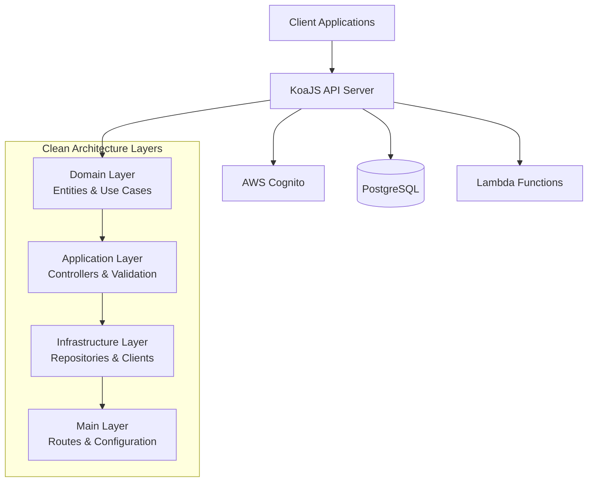

# Caveo Challenge - Backend API

### Note all the documentation was generate by Cloude AI.

[](https://www.typescriptlang.org/)
[](https://nodejs.org/)
[](https://koajs.com/)
[](https://aws.amazon.com/cognito/)

A production-ready Node.js/TypeScript backend API with JWT authentication, role-based authorization, and clean architecture patterns.

## 🚀 Quick Start

```bash
# Clone the repository
git clone <repository-url>
cd caveo-challenge/server

# Install dependencies
npm install

# Configure environment
cp .env.example .env
# Edit .env with your configuration

# Start local development (with Docker)
docker-compose up -d postgres
npm run migration:run
npm run dev
```

**🎯 API will be available at:** `http://localhost:3000`

## 📋 Project Overview

### **Key Features**
- ✅ **Clean Architecture** - Domain-driven design with clear separation of concerns
- ✅ **JWT Authentication** - AWS Cognito integration with role-based access control
- ✅ **TypeScript** - Full type safety with comprehensive schema validation
- ✅ **Database Management** - PostgreSQL with TypeORM and migrations
- ✅ **Docker Support** - Development and production containerization
- ✅ **Comprehensive Testing** - Unit tests, E2E tests with TestContainers
- ✅ **AWS Integration** - Production-ready infrastructure with Terraform

### **Technology Stack**
- **Runtime:** Node.js 22.17.0+
- **Language:** TypeScript 5.x
- **Framework:** KoaJS with middleware architecture
- **Database:** PostgreSQL with TypeORM
- **Authentication:** AWS Cognito + JWT
- **Testing:** Vitest + TestContainers
- **Infrastructure:** AWS + Terraform
- **Containerization:** Docker + Docker Compose

## 🏗️ Architecture



### **Core Business Features**
- 👤 **User Management** - Registration, authentication, profile management
- 🔐 **Role-Based Access** - Admin and user roles with different permissions
- 🔍 **User Search** - Advanced filtering and pagination
- 📊 **Account Management** - Profile editing and onboarding flow

## 📖 Documentation

| Documentation | Description |
|---------------|-------------|
| **[📚 Architecture Guide](./docs/architecture/README.md)** | Detailed architecture patterns, authentication flows, and component design |
| **[🐳 Local Development](./docs/LOCAL_DEVELOPMENT.md)** | Complete Docker-based local development setup |
| **[🏗️ Infrastructure](./docs/terraform/README.md)** | AWS infrastructure setup with Terraform |

## 🛠️ Development

### **Prerequisites**
- Node.js 22.17.0+
- Docker & Docker Compose
- AWS CLI (configured)

### **Available Commands**

```bash
# Development
npm run dev              # Start development server with hot reload
npm run create:env       # Create .env from example

# Building
npm run build            # Build for production
npm run type-check       # TypeScript type checking

# Testing
npm test                 # Unit tests
npm run test:e2e        # End-to-end tests
npm run test:cov        # Test coverage

# Database
npm run migration:run    # Run database migrations
npm run migration:revert # Revert last migration

# Code Quality
npm run lint             # ESLint checks
npm run lint:fix         # Fix linting issues
npm run format           # Format code
```

### **API Endpoints**

| Method | Endpoint | Description | Auth Required |
|--------|----------|-------------|---------------|
| `POST` | `/v1/auth` | User registration & sign-in | ❌ |
| `GET` | `/v1/me` | Get current user profile | ✅ |
| `PUT` | `/v1/users` | Update user account | ✅ |
| `GET` | `/v1/users` | Search users (admin) | ✅ Admin |
| `GET` | `/health` | Health check endpoint | ❌ |

## 🚀 Deployment

### **Environment Configuration**

The application requires these environment variables:

```bash
# Application
NODE_ENV=production
HOST=0.0.0.0
PORT=3000

# Database
DB_HOST=localhost
DB_PORT=5432
DB_NAME=caveo
DB_USER=caveo
DB_PASSWORD=your-secure-password

# AWS Cognito (from Terraform outputs)
AWS_REGION=us-east-1
AWS_COGNITO_USER_POOL_ID=your-pool-id
AWS_COGNITO_CLIENT_ID=your-client-id
AWS_COGNITO_CLIENT_SECRET=your-client-secret
JWT_EXPECTED_ISSUER=https://cognito-idp.region.amazonaws.com/pool-id
```

### **Production Deployment**

1. **Infrastructure Setup** - Deploy AWS resources with Terraform
2. **Application Deployment** - Docker-based deployment on EC2
3. **Database Migration** - Run migrations against production database

See [Infrastructure Documentation](./docs/terraform/README.md) for detailed deployment instructions.

## 🧪 Testing

The application includes comprehensive test coverage:

- **Unit Tests** - Domain entities, use cases, controllers
- **Integration Tests** - Database operations, external services
- **E2E Tests** - Full API workflow testing with TestContainers

```bash
# Run all tests
npm test

# Run specific test types
npm run test:e2e        # E2E tests only
npm run test:watch      # Watch mode for development

# Generate coverage report
npm run test:cov
```

## 🔐 Security

- **JWT Authentication** - Secure token-based authentication
- **RBAC** - Role-based access control (Admin/User)
- **Input Validation** - Zod schema validation on all inputs
- **SQL Injection Protection** - TypeORM parameterized queries
- **CORS** - Configurable cross-origin resource sharing
- **Environment Isolation** - Separate configurations for dev/staging/prod

## 📊 Monitoring & Logging

- **Structured Logging** - JSON-formatted logs for production
- **Health Checks** - Endpoint for load balancer health checks
- **Error Handling** - Centralized error processing and logging
- **Request Logging** - HTTP request/response logging middleware

## 🤝 Contributing

1. Fork the repository
2. Create your feature branch (`git checkout -b feature/amazing-feature`)
3. Run tests (`npm test`)
4. Commit your changes (`git commit -m 'Add amazing feature'`)
5. Push to the branch (`git push origin feature/amazing-feature`)
6. Open a Pull Request

## 📝 License

This project is part of the Caveo technical challenge.

---

**📧 Contact:** [simao.msjr@gmail.com](mailto:simao.msjr@gmail.com)
