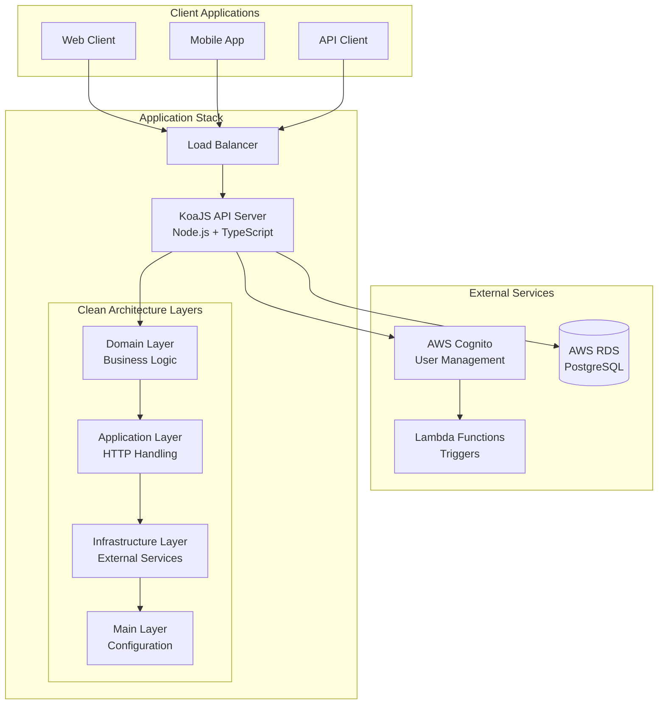

# 📚 Caveo Backend Documentation

> **Documentation for the Caveo Challenge backend API**

Welcome to the complete documentation for the Caveo Backend API. This documentation covers everything from local development to production deployment.

## 📖 Documentation Overview

| Document | Description | Audience |
|----------|-------------|----------|
| **[🏗️ Architecture Guide](./architecture/README.md)** | Deep dive into system architecture, design patterns, and component relationships | Developers, Architects |
| **[🐳 Local Development](./LOCAL_DEVELOPMENT.md)** | Complete setup guide for local development with Docker | Developers |
| **[🏗️ Infrastructure](./terraform/README.md)** | AWS infrastructure setup and deployment guide | DevOps, Infrastructure |

---

## 🚀 Quick Navigation

### **For Developers**
- **Getting Started** → [Local Development Guide](./LOCAL_DEVELOPMENT.md)
- **Understanding the System** → [Architecture Guide](./architecture/README.md)
- **API Reference** → [Main README](../README.md#-api-endpoints)

### **For DevOps/Infrastructure**
- **AWS Setup** → [Terraform Documentation](./terraform/README.md)
- **Production Deployment** → [Infrastructure Guide](./terraform/README.md#-deployment-steps)
- **Environment Configuration** → [Architecture - Configuration](./architecture/README.md#️-configuration--environment)

### **For Architects**
- **System Design** → [Architecture Overview](./architecture/README.md#-system-overview)
- **Security Model** → [Security Architecture](./architecture/README.md#-security-architecture)
- **Database Design** → [Data Architecture](./architecture/README.md#️-database-architecture)

---

## 🎯 Key Features Covered

### **🏗️ Architecture & Design**
- ✅ Clean Architecture implementation
- ✅ Domain-driven design patterns
- ✅ SOLID principles application
- ✅ Dependency injection patterns

### **🔐 Authentication & Security**
- ✅ AWS Cognito integration
- ✅ JWT token validation
- ✅ Role-based access control (RBAC)
- ✅ Security best practices

### **🗄️ Data Management**
- ✅ PostgreSQL database design
- ✅ TypeORM integration
- ✅ Migration strategies
- ✅ Data modeling patterns

### **🧪 Testing & Quality**
- ✅ Unit testing strategies
- ✅ Integration testing with TestContainers
- ✅ E2E testing workflows
- ✅ Code quality practices

### **🚀 Deployment & Operations**
- ✅ Docker containerization
- ✅ AWS infrastructure as code
- ✅ Environment management
- ✅ Monitoring and logging

---

## 📊 System Architecture Overview



---

## 🛠️ Technology Stack Summary

| Layer | Technology | Version | Purpose |
|-------|------------|---------|---------|
| **Runtime** | Node.js | 22.17.0+ | JavaScript execution environment |
| **Language** | TypeScript | 5.x | Type-safe JavaScript development |
| **Framework** | KoaJS | 2.x | Minimal HTTP server framework |
| **Database** | PostgreSQL | 15+ | Primary data store |
| **ORM** | TypeORM | 0.3.x | Database abstraction layer |
| **Authentication** | AWS Cognito | - | User management & JWT tokens |
| **Infrastructure** | AWS + Terraform | - | Cloud infrastructure as code |
| **Testing** | Vitest + TestContainers | - | Unit & integration testing |
| **Validation** | Zod | 3.x | Runtime schema validation |
| **Containerization** | Docker | - | Application containerization |

---

## 📋 Development Workflow

### **1. Initial Setup**
```bash
# Clone and setup
git clone https://github.com/simaojunior/caveo-challenge
cd caveo-challenge/server
npm install

# Environment configuration
npm run create:env
# Edit .env with your values
```

### **2. Local Development**
```bash
# Start services
docker-compose up -d postgres
npm run migration:run

# Start development server
npm run dev
```

### **3. Testing & Quality**
```bash
# Run tests
npm test              # Unit tests
npm run test:e2e      # E2E tests
npm run test:cov      # Coverage report

# Code quality
npm run lint          # Linting
npm run type-check    # TypeScript validation
```

### **4. Terraform Workflow**
```bash
# Infrastructure
cd terraform/
terraform plan
terraform apply
```
---

## 🎯 Getting Started Checklist

### **For New Developers:**
- [ ] Read the [Main README](../README.md) for project overview
- [ ] Follow the [Local Development Setup](./LOCAL_DEVELOPMENT.md)
- [ ] Study the [Architecture Guide](./architecture/README.md) for system understanding
- [ ] Run the test suite to verify setup: `npm test && npm run test:e2e`
- [ ] Make a small change and create a PR to validate workflow

### **For DevOps Engineers:**
- [ ] Review [Infrastructure Documentation](./terraform/README.md)
- [ ] Set up AWS credentials and Terraform state
- [ ] Deploy development environment with Terraform
- [ ] Configure monitoring and logging
- [ ] Set up CI/CD pipelines

### **For Architects:**
- [ ] Review [System Architecture](./architecture/README.md#-system-overview)
- [ ] Understand [Authentication Flow](./architecture/README.md#-authentication--authorization-architecture)
- [ ] Study [Database Design](./architecture/README.md#️-database-architecture)
- [ ] Analyze [Security Model](./architecture/README.md#-security-architecture)

---
