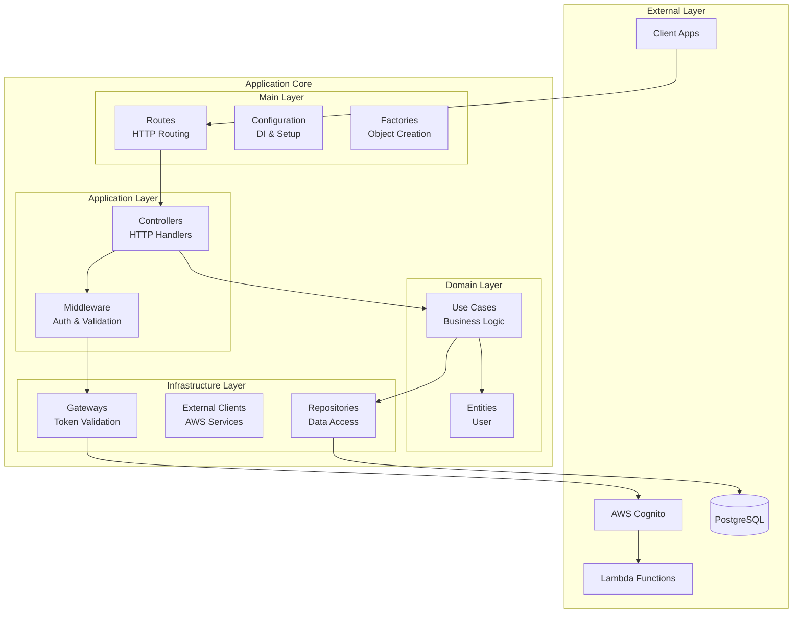
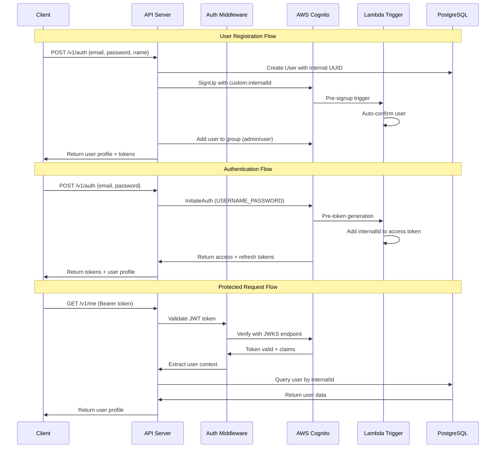
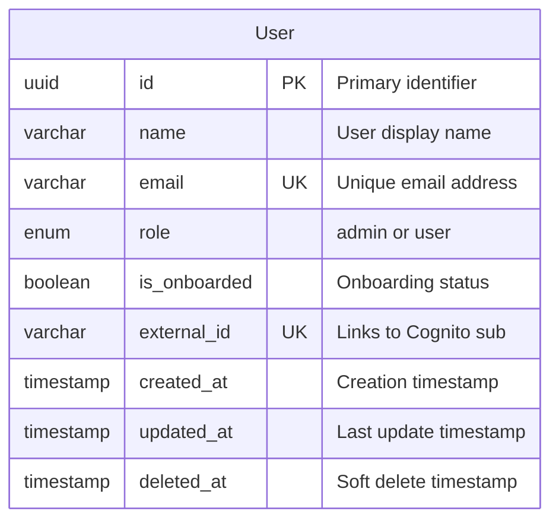

# 🏗️ Application Architecture

> **Clean Architecture implementation for a Node.js/TypeScript backend with AWS Cognito authentication**

## 📊 System Overview

This application follows **Clean Architecture** principles with clear separation of concerns, implementing JWT-based authentication with AWS Cognito and role-based authorization.



## 🛠️ Technology Stack

| Category | Technology | Version | Purpose |
|----------|------------|---------|---------|
| **Runtime** | Node.js | 22.17.0+ | JavaScript runtime |
| **Language** | TypeScript | 5.x | Type-safe JavaScript |
| **Framework** | KoaJS | 2.x | HTTP server framework |
| **Database** | PostgreSQL | 15+ | Primary data store |
| **ORM** | TypeORM | 0.3.x | Database abstraction |
| **Authentication** | AWS Cognito | - | User management & JWT |
| **Testing** | Vitest | 2.x | Unit & integration tests |
| **Container** | TestContainers | - | E2E testing with real services |
| **Validation** | Zod | 3.x | Runtime type validation |

## 🏗️ Architecture Layers

### 🎯 Domain Layer (`src/domain/`)
> **Core business logic and entities - framework independent**

```typescript
src/domain/
├── entities/           # Business entities with pure logic
│   └── user.ts        # User entity with business rules
├── use-cases/         # Application business operations
│   ├── auth/          # Authentication operations
│   │   └── signin-or-register.ts
│   └── user/          # User management operations
│       ├── get-me.ts
│       ├── edit-account.ts
│       └── search-users.ts
├── contracts/         # Interfaces for external dependencies
│   ├── repos/         # Repository interfaces
│   ├── clients/       # External service interfaces
│   └── gateways/      # Gateway interfaces
└── errors/           # Domain-specific error types
```

**Key Principles:**
- ✅ **No external dependencies** - Pure business logic
- ✅ **Rich domain models** - Entities contain business behavior
- ✅ **Use case driven** - Each operation is a explicit use case
- ✅ **Interface segregation** - Small, focused contracts

### 📋 Application Layer (`src/application/`)
> **HTTP handling, validation, and request/response transformation**

```typescript
src/application/
├── controllers/       # HTTP request handlers
│   ├── auth/
│   │   └── signin-or-register.ts  # Auth endpoint logic
│   └── user/
│       ├── get-me.ts             # User profile retrieval
│       ├── edit-account.ts       # Profile editing
│       └── search-users.ts       # User search with pagination
├── contracts/         # Application layer interfaces
│   ├── controller.ts  # Base controller abstraction
│   ├── http.ts       # HTTP types and interfaces
│   └── middleware.ts # Middleware contracts
├── helpers/          # HTTP utilities
│   └── http.ts      # Response builders (ok, created, error)
└── middlewares/      # Request processing middleware
    ├── authentication.ts  # JWT validation
    ├── authorization.ts   # Role-based access control
    └── error-handler.ts   # Global error handling
```

**Key Features:**
- 🔒 **Input validation** - Zod schemas for all endpoints
- 🎯 **Single responsibility** - One controller per use case
- 📝 **Type safety** - Full TypeScript coverage
- 🛡️ **Error handling** - Centralized error processing

### 🔧 Infrastructure Layer (`src/infra/`)
> **External services, databases, and framework-specific implementations**

```typescript
src/infra/
├── clients/          # External service integrations
│   └── cognito.ts   # AWS Cognito SDK client
├── gateways/        # Service adapters
│   ├── auth.ts      # Authentication gateway
│   └── jwt-token-handler.ts  # JWT validation logic
├── repos/           # Data access implementations
│   └── postgres/
│       ├── entities/     # TypeORM entity definitions
│       ├── migrations/   # Database schema migrations
│       ├── repos/       # Repository implementations
│       └── helpers/     # Database utilities
└── shared/          # Shared infrastructure utilities
    └── logging/     # Structured logging setup
```

**Integration Points:**
- 🗄️ **Database** - PostgreSQL with TypeORM
- ☁️ **AWS Cognito** - User authentication and management
- 🔐 **JWT Validation** - Token verification with JWKS
- 📊 **Logging** - Structured JSON logging

### ⚙️ Main Layer (`src/main/`)
> **Framework configuration, dependency injection, and application bootstrap**

```typescript
src/main/
├── config/           # Application configuration
│   ├── app-config.ts # Environment variable management
│   ├── app.ts       # KoaJS application setup
│   ├── middlewares.ts # Middleware registration
│   ├── routes.ts    # Route definitions
│   └── swagger.ts   # API documentation
├── factories/        # Dependency injection
│   ├── application/  # Controller factories
│   ├── domain/      # Use case factories
│   └── infra/       # Infrastructure factories
├── middlewares/      # Framework-specific middleware
│   ├── authentication.ts # Koa authentication adapter
│   ├── authorization.ts  # Koa authorization adapter
│   └── error-handler.ts  # Koa error handling adapter
├── routes/          # HTTP route definitions
│   └── auth.ts      # Authentication routes
├── adapters/        # Framework adapters
│   └── koa-router.ts # Koa route adapter
└── index.ts         # Application entry point
```

## 🔐 Authentication & Authorization Architecture

### 🎯 Authentication Flow Overview



### 🔒 Role-Based Access Control (RBAC)

The application implements a two-tier role system:

| Role | Permissions | Endpoints |
|------|------------|-----------|
| **USER** | View own profile, edit own account | `GET /v1/me`, `PUT /v1/users` (own account) |
| **ADMIN** | All user permissions + user management | All USER endpoints + `GET /v1/users` (search) |

**Implementation:**
```typescript
// Middleware configuration
export const requireUser = authorizationMiddleware([UserRole.USER, UserRole.ADMIN]);
export const requireAdmin = authorizationMiddleware([UserRole.ADMIN]);

// Route protection
router.get('/v1/me', requireUser, adaptKoaRoute(makeMeController()));
router.get('/v1/users', requireAdmin, adaptKoaRoute(makeSearchUsersController()));
```
## 🛠️ Core Components Deep Dive

### 🎯 User Entity (`src/domain/entities/user.ts`)

The User entity encapsulates all business logic related to users:

```typescript
export class User {
  private constructor(private props: UserProps) {}

  // Factory method for creating new users
  static create(props: CreateUserProps): User {
    return new User({
      id: props.id ?? crypto.randomUUID(),
      role: props.role ?? UserRole.USER,
      isOnboarded: props.isOnboarded ?? false,
      createdAt: props.createdAt ?? new Date(),
      ...props,
    });
  }

  // Business operations
  markAsOnboarded(): void {
    this.props.isOnboarded = true;
    this.touch();
  }

  setExternalId(externalId: string): void {
    this.props.externalId = externalId;
    this.touch();
  }

  // Value object pattern
  toJSON() { /* ... */ }
}

export const UserRole = {
  ADMIN: 'admin',
  USER: 'user',
} as const;
```

**Key Features:**
- ✅ **Rich domain model** - Contains business behavior, not just data
- ✅ **Immutable by design** - Private constructor prevents invalid states
- ✅ **Factory pattern** - Controlled object creation
- ✅ **Business operations** - Domain-specific methods like `markAsOnboarded()`

### 🎮 Controllers Pattern

Controllers handle HTTP concerns while delegating business logic to use cases:

```typescript
export class GetMeController extends Controller {
  constructor(private readonly getMeUseCase: GetMeUseCase) {
    super();
  }

  async handle(request: HttpRequest): Promise<HttpResponse> {
    // 1. Input validation with Zod schemas
    const { id, roles } = inputSchema.parse(request.user);

    // 2. Delegate to use case
    const user = await this.getMeUseCase({ id, roles });

    // 3. Transform response
    return httpResponse.ok({
      id: user.id,
      name: user.name,
      email: user.email,
      role: user.role,
      isOnboarded: user.isOnboarded,
    });
  }
}
```

### 🔐 Authentication Middleware

Multi-layered authentication and authorization:

```typescript
// JWT Token Validation
export class JwtTokenHandler implements ITokenValidator {
  async validate({ token }): Promise<TokenClaims> {
    // 1. Fetch JWKS from AWS Cognito
    const keySet = await this.getKeySet();

    // 2. Verify JWT signature and claims
    const { payload } = await jwtVerify(token, keySet, {
      issuer: this.expectedIssuer,
      audience: this.clientId,
    });

    // 3. Extract required claims
    return {
      sub: payload.sub,
      groups: payload['cognito:groups'] || [],
    };
  }
}

// Role-based Authorization
export const authorizationMiddleware = (requiredRoles: UserRoleType[]) => {
  return async (ctx: IAppContext, next: Next) => {
    // Extract and validate JWT
    const token = extractBearerToken(ctx.headers.authorization);
    const claims = await tokenHandler.validate({ token });

    // Check role permissions
    const hasPermission = claims.groups.some(group =>
      requiredRoles.includes(group as UserRoleType)
    );

    if (!hasPermission) {
      throw new ForbiddenError('Insufficient permissions');
    }

    // Set user context
    ctx.state.user = {
      id: claims.sub,
      roles: claims.groups,
      jwt: token,
    };

    await next();
  };
};
```

## 🗄️ Database Architecture

### 📊 Data Model



**Key Design Decisions:**
- ✅ **UUID Primary Keys** - Prevents enumeration attacks
- ✅ **External ID Mapping** - Links internal users to Cognito accounts
- ✅ **Soft Deletes** - Preserves data integrity and audit trails
- ✅ **Indexed Fields** - Performance optimization on email and external_id
- ✅ **Enum Constraints** - Database-level role validation

### 🔗 Database Integration Pattern

The application uses a dual-model approach for data handling:

```typescript
// Domain Entity (Business Logic)
export class User {
  private constructor(private props: UserProps) {}

  markAsOnboarded(): void {
    this.props.isOnboarded = true;
    this.touch();
  }
}

// Infrastructure Entity (Database Mapping)
@Entity('users')
export class User {
  @PrimaryColumn('uuid')
  id!: string;

  @Column({ type: 'varchar', length: 255, unique: true })
  @Index('idx_user_email')
  email!: string;

  @Column({
    type: 'enum',
    enum: UserRole,
    default: UserRole.USER,
  })
  role!: UserRole;
}
```

**Benefits:**
- 🎯 **Separation of Concerns** - Domain logic separate from persistence
- 🔒 **Type Safety** - Full TypeScript coverage at all layers
- 🚀 **Performance** - Optimized queries with proper indexing
- 🔄 **Migration Support** - Version-controlled schema changes

### 📈 Performance Considerations

| Optimization | Implementation | Impact |
|--------------|----------------|---------|
| **Indexed Email** | `@Index('idx_user_email')` | Fast user lookups during auth |
| **Indexed External ID** | Database constraint | Quick Cognito → User mapping |
| **Connection Pooling** | TypeORM configuration | Efficient database connections |
| **Query Optimization** | Repository pattern | Controlled database access |

## 🛣️ API Architecture

### 🎯 RESTful Endpoint Design

| HTTP Method | Endpoint | Controller | Use Case | Authorization |
|-------------|----------|------------|----------|---------------|
| `POST` | `/v1/auth` | `SigninOrRegisterController` | `SigninOrRegisterUseCase` | Public |
| `GET` | `/v1/me` | `GetMeController` | `GetMeUseCase` | User/Admin |
| `PUT` | `/v1/users` | `EditAccountController` | `EditAccountUseCase` | User/Admin |
| `GET` | `/v1/users` | `SearchUsersController` | `SearchUsersUseCase` | Admin Only |
| `GET` | `/health` | `HealthCheckController` | `HealthCheckUseCase` | Public |

### 📝 Request/Response Patterns

**Consistent Response Format:**
```typescript
// Success Response
{
  "data": {
    "id": "uuid",
    "name": "User Name",
    "email": "user@example.com",
    "role": "user",
    "isOnboarded": true
  }
}

// Error Response
{
  "error": {
    "code": "VALIDATION_ERROR",
    "message": "Invalid input provided",
    "details": [
      {
        "field": "email",
        "message": "Must be a valid email address"
      }
    ]
  }
}
```

**Input Validation Strategy:**
- 🔍 **Zod Schemas** - Runtime type validation for all inputs
- 🛡️ **Sanitization** - Automatic data cleaning and transformation
- 📊 **Error Aggregation** - Collect all validation errors before response
- 🎯 **Type Safety** - Compile-time and runtime type checking

## ⚙️ Configuration & Environment

### 🔧 Environment Configuration Schema

The application uses **Zod** for environment validation with fail-fast behavior:

```typescript
// Environment variable validation
const envSchema = z.object({
  NODE_ENV: z.enum(['development', 'test', 'production']),
  PORT: z.coerce.number().int().min(1).max(65535).default(3000),
  HOST: z.string().default('localhost'),

  // Database Configuration
  DB_HOST: z.string().min(1),
  DB_PORT: z.coerce.number().int().default(5432),
  DB_NAME: z.string().min(1),
  DB_USER: z.string().min(1),
  DB_PASSWORD: z.string().min(1),

  // AWS Cognito Configuration
  AWS_REGION: z.string().default('us-east-1'),
  AWS_COGNITO_USER_POOL_ID: z.string().min(1),
  AWS_COGNITO_CLIENT_ID: z.string().min(1),
  AWS_COGNITO_CLIENT_SECRET: z.string().min(1),
  JWT_EXPECTED_ISSUER: z.string().url(),
});

export const config = envSchema.parse(process.env);
```

**Configuration Benefits:**
- ✅ **Fail Fast** - Application won't start with invalid configuration
- ✅ **Type Safety** - Runtime validation with TypeScript types
- ✅ **Documentation** - Self-documenting configuration schema
- ✅ **Defaults** - Sensible fallback values for development

### 🏗️ Development vs Production

| Aspect | Development | Production |
|--------|-------------|------------|
| **Database** | Local PostgreSQL (Docker) | AWS RDS PostgreSQL |
| **Authentication** | Cognito Dev Pool | Cognito Prod Pool |
| **Logging** | Console + Query logs | JSON structured logs |
| **Error Handling** | Stack traces exposed | Generic error messages |
| **CORS** | Permissive settings | Restrictive domain list |
| **SSL/TLS** | HTTP allowed | HTTPS enforced |

## 🧪 Testing Architecture

### 🎯 Testing Strategy

```mermaid
pyramid
    title Testing Pyramid
    "E2E Tests" : 10
    "Integration Tests" : 30
    "Unit Tests" : 60
```

**Test Categories:**

| Test Type | Scope | Tools | Examples |
|-----------|--------|-------|----------|
| **Unit Tests** | Individual functions/classes | Vitest | Entity logic, Use cases, Controllers |
| **Integration Tests** | Multiple components | Vitest + Mocks | Repository operations, API endpoints |
| **E2E Tests** | Full application flow | Vitest + TestContainers | Auth flow, User management |

### 🔧 Testing Utilities

```typescript
// Test Containers for E2E tests
const postgres = await new PostgreSqlContainer('postgres:15')
  .withDatabase('test_db')
  .withUsername('test_user')
  .withPassword('test_password')
  .start();

// Controller Testing Pattern
describe('GetMeController', () => {
  let sut: GetMeController;
  let getMeUseCase: MockedFunction<GetMeUseCase>;

  beforeEach(() => {
    getMeUseCase = vi.fn();
    sut = new GetMeController(getMeUseCase);
  });

  it('should return user data successfully', async () => {
    // Arrange
    const mockUser = { id: 'uuid', name: 'Test User' };
    getMeUseCase.mockResolvedValue(mockUser);

    // Act
    const response = await sut.handle(mockRequest);

    // Assert
    expect(response.statusCode).toBe(200);
    expect(response.data).toEqual(mockUser);
  });
});
```

## 🔒 Security Architecture

### 🛡️ Security Layers

1. **Input Validation** - Zod schemas prevent malicious input
2. **Authentication** - JWT verification with AWS Cognito JWKS
3. **Authorization** - Role-based access control at endpoint level
4. **Database Security** - TypeORM prevents SQL injection
5. **Environment Isolation** - Separate configs for each environment

### 🔐 Security Best Practices

| Security Concern | Implementation | Location |
|------------------|----------------|----------|
| **JWT Validation** | JWKS-based verification | `JwtTokenHandler` |
| **SQL Injection** | Parameterized queries | TypeORM repositories |
| **Input Sanitization** | Zod schema validation | All controllers |
| **Role Enforcement** | Middleware-based RBAC | Authorization middleware |
| **Sensitive Data** | Environment variables | `.env` files |
| **CORS Protection** | Configurable origins | KoaJS middleware |

---

## 📚 Additional Resources

- **[🐳 Local Development Setup](../LOCAL_DEVELOPMENT.md)** - Complete Docker development environment
- **[🏗️ Infrastructure Guide](../terraform/README.md)** - AWS infrastructure with Terraform
- **[📖 API Documentation](../../server/src/main/config/swagger.json)** - OpenAPI specification

This architecture provides a **scalable, maintainable, and secure** foundation for the Caveo backend API with clear separation of concerns and comprehensive testing coverage.
